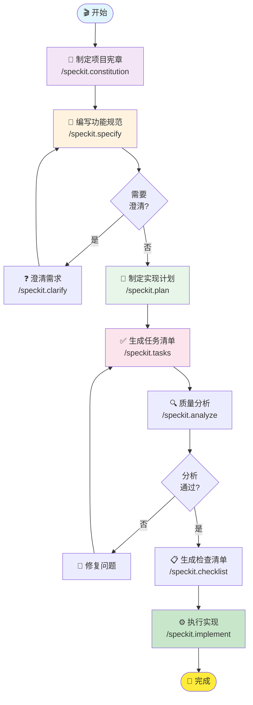

# 🇨🇳 Spec-Kit 中文汉化版

<div align="center">

**GitHub 官方规范驱动开发工具包 · 完整中文汉化**

[](https://opensource.org/licenses/MIT)
[](README.md)
[](https://cursor.sh)
[](https://github.com/github/spec-kit)

**[快速开始](#-快速开始)** | **[命令参考](#-命令参考)** | **[工作流程](#-工作流程)** | **[原版对比](#-汉化说明)**

</div>

---

## 📖 项目简介

**Spec-Kit 中文汉化版**是 GitHub 官方 Spec-Kit 工具的完整中文本地化版本，专为中文开发者优化。

### 💡 什么是 Spec-Kit？

Spec-Kit 是 GitHub 开源的**规范驱动开发（Spec-Driven Development）**工具包，帮助你：


### ✨ 核心特性

| 特性 | 说明 | 优势 |
|------|------|------|
| 🎯 **规范驱动** | 从需求到代码全流程文档化 | 减少返工，提高质量 |
| 🤖 **AI 集成** | 深度集成 Cursor AI 编辑器 | 自动化文档生成 |
| 🔄 **流程规范** | 标准化的开发工作流 | 团队协作更高效 |
| 📚 **模板丰富** | 预置多种文档模板 | 开箱即用 |
| 🇨🇳 **完整汉化** | 所有交互界面中文化 | 中文开发者友好 |

---

## 🚀 快速开始

### 📋 前置要求

<details>
<summary><b>点击查看安装要求</b></summary>

- ✅ **Python 3.10+** - Python 运行环境
- ✅ **uv** - 现代 Python 包管理器
- ✅ **Git** - 版本控制系统
- ✅ **Cursor** - AI 代码编辑器（推荐）

</details>

### 🔧 安装步骤

#### 方式一：使用模板创建（推荐）

```bash
# 1. 从 GitHub 模板创建新项目
gh repo create my-project \
  --template 888888888881/spec-kit-chinese \
  --public

# 2. 克隆到本地
git clone https://github.com/YOUR_USERNAME/my-project.git
cd my-project

# 3. 安装 Spec-Kit
uv tool install spec
```

#### 方式二：直接克隆使用

```bash
# 1. 克隆仓库
git clone https://github.com/888888888881/spec-kit-chinese.git
cd spec-kit-chinese

# 2. 安装工具
uv tool install spec

# 3. 初始化（如果需要）
specify init --here --ai cursor --force
```

### ✅ 验证安装

```bash
# 检查工具版本
specify --help

# 应显示中文化的帮助信息
```

---

## 🎯 核心工作流程

### 📊 完整开发流程



### 🛠️ 快速上手示例

<details>
<summary><b>点击查看完整示例</b></summary>

#### 1️⃣ 制定项目宪章

```bash
# 在 Cursor 中执行
/speckit.constitution

# 定义核心原则，如：
# - 代码质量标准
# - 文档规范
# - 测试要求
```

#### 2️⃣ 创建功能规范

```bash
# 描述功能需求
/speckit.specify 实现用户登录功能，支持邮箱和密码登录
```

#### 3️⃣ 澄清模糊需求（可选）

```bash
# 自动识别并澄清规范中的模糊点
/speckit.clarify
```

#### 4️⃣ 制定实现计划

```bash
# 生成技术实现方案
/speckit.plan
```

#### 5️⃣ 生成任务清单

```bash
# 将计划分解为可执行任务
/speckit.tasks
```

#### 6️⃣ 质量分析

```bash
# 检查文档一致性
/speckit.analyze
```

#### 7️⃣ 生成检查清单

```bash
# 创建验收标准
/speckit.checklist
```

#### 8️⃣ 执行实现

```bash
# 按任务清单逐步实现
/speckit.implement
```

</details>

---

## 📚 命令参考

### 🎯 8 大核心命令

| 命令 | 用途 | 输入 | 输出 |
|------|------|------|------|
| 📜 `/speckit.constitution` | 定义项目核心原则和开发规范 | 项目原则 | `constitution.md` |
| 📝 `/speckit.specify` | 将功能需求转化为清晰规范 | 功能描述 | `spec.md` |
| ❓ `/speckit.clarify` | 解决规范中的模糊和歧义 | 现有规范 | 更新的 `spec.md` |
| 🎯 `/speckit.plan` | 制定功能的技术实现方案 | 规范文档 | `plan.md` |
| ✅ `/speckit.tasks` | 将技术方案分解为任务清单 | 实现计划 | `tasks.md` |
| ⚙️ `/speckit.implement` | 按任务清单逐步实现代码 | 任务清单 | 代码文件 |
| 🔍 `/speckit.analyze` | 检查规范、计划、任务一致性 | 所有文档 | 分析报告 |
| 📋 `/speckit.checklist` | 生成需求质量验证清单 | 功能规范 | 检查清单 |

### 📖 详细文档

查看 **[命令快速参考.md](./命令快速参考.md)** 了解每个命令的详细用法。

---

## 📁 项目结构

```
spec-kit-chinese/
├── 📂 .cursor/              # Cursor 编辑器配置
│   └── commands/            # 8个中文命令定义
│       ├── speckit.constitution.md
│       ├── speckit.specify.md
│       ├── speckit.clarify.md
│       ├── speckit.plan.md
│       ├── speckit.tasks.md
│       ├── speckit.implement.md
│       ├── speckit.analyze.md
│       └── speckit.checklist.md
│
├── 📂 .specify/             # Spec-Kit 核心文件
│   ├── memory/              # 项目记忆
│   │   └── constitution.md  # 项目宪章
│   ├── templates/           # 中文模板
│   │   ├── spec-template.md
│   │   ├── plan-template.md
│   │   ├── tasks-template.md
│   │   ├── checklist-template.md
│   │   └── agent-file-template.md
│   └── scripts/             # Shell 脚本
│
├── 📂 specs/                # 功能规范目录（自动生成）
│
├── 📄 README.md             # 项目说明（本文件）
├── 📄 命令快速参考.md        # 命令速查表
├── 📄 LICENSE               # MIT 许可证
└── 📄 .gitignore            # Git 忽略规则
```

---

## 🌟 汉化说明

### ✅ 已汉化内容

| 类别 | 内容 | 状态 |
|------|------|------|
| 🎯 **命令描述** | 8 个命令的 `description` 字段 | ✅ 完成 |
| 📖 **命令文档** | `.cursor/commands/*.md` 内容 | ✅ 完成 |
| 📝 **文档模板** | 5 个核心模板文件 | ✅ 完成 |
| 📜 **项目宪章** | Constitution 模板 | ✅ 完成 |
| 📚 **使用文档** | README 和快速参考 | ✅ 完成 |

### ⚠️ 未汉化内容（保持英文原因）

| 内容 | 原因 |
|------|------|
| 命令触发关键字 | 确保 AI 工具兼容性 |
| 文件名和路径 | 避免跨平台编码问题 |
| Shell 脚本 | 保证系统稳定性 |
| Git 配置 | 遵循版本控制标准 |

### 🎯 汉化原则

本项目遵循 **"客户交互优先，程序稳定为本"** 的原则：

1. ✅ **强制汉化**：所有面向用户的交互界面
2. ⚠️ **选择汉化**：可能影响功能的技术标识保持英文
3. 🔍 **质量保证**：每次修改后验证功能正常

详见 [项目宪章](.specify/memory/constitution.md)

---

## 🤝 使用场景

### 💼 适用项目

- ✅ 需要规范化开发流程的团队项目
- ✅ 要求文档化的企业级应用
- ✅ 多人协作的复杂功能开发
- ✅ AI 辅助的敏捷开发

### 👥 适用人群

- 🎯 需要结构化开发流程的**项目经理**
- 💻 希望提高代码质量的**开发工程师**
- 📝 关注文档完整性的**技术写作者**
- 🤖 使用 AI 工具的**独立开发者**

---

## 🔗 相关链接

- 📦 **原版项目**: [github/spec-kit](https://github.com/github/spec-kit)
- 🤖 **Cursor 编辑器**: [cursor.sh](https://cursor.sh)
- 📖 **Spec-Kit 博客**: [Spec-Kit 使用指南](https://blog.chensoul.cc/posts/2025/09/29/spec-kit-with-cursor/)
- 🇨🇳 **汉化版仓库**: [spec-kit-chinese](https://github.com/888888888881/spec-kit-chinese)

---

## 📄 开源许可

本项目基于 **MIT License** 开源，详见 [LICENSE](./LICENSE) 文件。

---

## ❓ 常见问题

<details>
<summary><b>Q: 为什么命令名不是中文？</b></summary>

A: 为了确保 AI 工具的稳定性和跨平台兼容性，命令触发关键字保持英文。所有用户可见的描述和文档内容均已汉化。
</details>

<details>
<summary><b>Q: 如何在新项目中使用？</b></summary>

A: 有两种方式：
1. 使用 GitHub 模板创建新仓库（推荐）
2. 直接克隆后在项目目录执行 `specify init`
</details>

<details>
<summary><b>Q: 汉化会影响工具功能吗？</b></summary>

A: 不会。我们只汉化了面向用户的交互内容，核心逻辑和技术标识保持原样，确保工具稳定运行。
</details>

<details>
<summary><b>Q: 是否支持其他 AI 编辑器？</b></summary>

A: 目前主要支持 Cursor。理论上支持其他兼容 Spec-Kit 的 AI 工具，但未经充分测试。
</details>

---

<div align="center">

### 🎉 开始你的规范驱动开发之旅！

**[⬆️ 返回顶部](#-spec-kit-中文汉化版)**

---

Made with ❤️ by Chinese Developers | 基于 [GitHub Spec-Kit](https://github.com/github/spec-kit)

</div>
